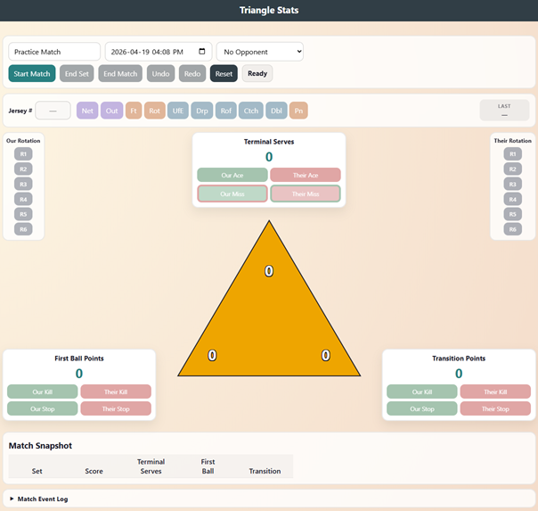
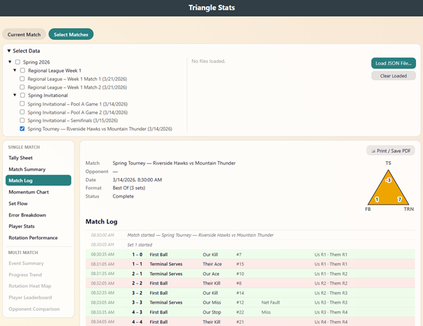
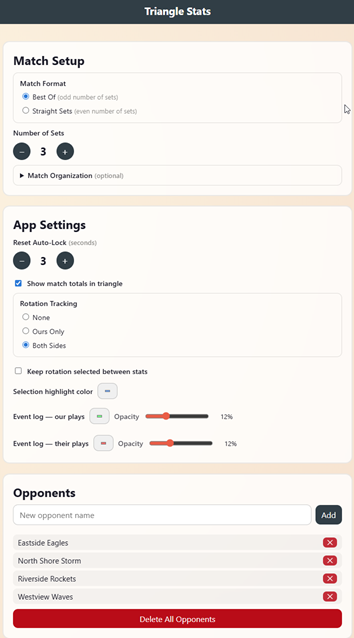

# Triangle Stats

Triangle Stats is a browser-based volleyball tracking tool built around **The Triangle**, created by [Joe Trinsey](https://smartervolley.substack.com/).

The Triangle breaks a match into three areas:
- Terminal Serves
- First Ball Points
- Transition Points

It gives coaches a fast triage view of where sets are being won or lost.

Read Joe's original write-up at [Smarter Volley: The Triangle](https://smartervolley.substack.com/p/thetriangle).

## Live App

**[https://j-mathes.github.io/volleyball-triangle-stats/](https://j-mathes.github.io/volleyball-triangle-stats/)**

Works on desktop and iPad/iPhone. No install required — open the link in any modern browser.

> **Note for iPad/iPhone users:** Use the link above. Opening `index.html` as a local file on iOS is not supported due to browser storage restrictions.

> **Not seeing recent changes?** Your browser may be serving a cached version of the page. Clear your browser cache and reload to pick up the latest updates. On iPhone/iPad: go to **Settings → Safari → Clear History and Website Data**, then reopen the link. On desktop: press **Ctrl+Shift+R** (Windows/Linux) or **Cmd+Shift+R** (Mac) to force a hard reload.

## Screenshots

| Stats | Reports | Setup |
|-------|---------|-------|
|  |  |  |

## Features

- Fast in-match tracking with 12 Triangle stat buttons
- Dedicated pages for live tracking, reports, history, and setup
- Rotation tracking options (none, ours only, both sides)
- Optional context on each touch: jersey number, rotation, and event code
- Opponent management and assignment before match start
- Custom event codes for your staff's language and tagging style
- Undo/redo for quick correction during live charting
- Single-match and multi-match reports for review
- Import/export for sharing and backup

## Coach Workflow

1. Open `index.html` in Chrome, Firefox, or Edge.
2. Go to **Setup** and configure as needed:
   - match format and set count
   - rotation tracking mode
   - season/event organization
   - opponents
   - event codes
3. Go to **Stats**, enter match metadata, then click **Start Match**.
4. Record events with the Triangle stat buttons.
5. Use **Undo** and **Redo** during play when needed.
6. End sets with **End Set**, and finish with **End Match**.
7. Use **History** to resume unfinished matches or manage saved ones.
8. Use **Reports** for debriefs, film sessions, and practice planning.

## Pages

| Page | Purpose |
|------|---------|
| **Stats** | Live touch-by-touch tracking during sets |
| **Reports** | Turn tracked data into usable coaching summaries |
| **History** | Resume, review, export, import, and clean up saved matches |
| **Setup** | Configure match format, tracking behavior, opponents, and event codes |

## What the Triangle Measures

The Triangle has three categories, each with four tracked actions (12 total buttons):

| Category | Formula | Buttons |
|----------|---------|---------|
| **Terminal Serves** | (our aces + their misses) − (their aces + our misses) | Our Ace, Their Ace, Our Miss, Their Miss |
| **First Ball Points** | (our kills + our stops) − (their kills + their stops) | Our Kill, Their Kill, Our Stop, Their Stop |
| **Transition Points** | (our kills + our stops) − (their kills + their stops) | Our Kill, Their Kill, Our Stop, Their Stop |

## Metadata and Event Codes

Each stat can include optional metadata:
- Jersey number
- Rotation (based on your selected tracking mode)
- Event code

Blank fields are not recorded.

Event codes are user-defined on the Setup page. Each code includes:
- code (stored value)
- abbreviation (button and tally label)
- description
- category

Code category controls which stat types accept the code and the button color:

| Color | Category | Applies to |
|-------|---------|------------|
| Purple | Both | Serve misses and stops |
| Orange | Serve miss only | Serve misses only |
| Blue | Stop/error only | Stops and defensive errors only |

If a selected code does not apply to the pressed stat, it is ignored.

## Reports

Reports can be generated from:
- Current Match
- Any selected group of saved or imported matches

Selection rules:
- Single-match reports require exactly 1 match
- Multi-match reports require 2 or more matches

Available report groups:
- Single Match: Tally Sheet, Match Summary, Momentum Chart, Set Flow, Error Breakdown, Player Stats, Rotation Performance
- Multi Match: Event Summary, Progress Trend, Rotation Heat Map, Player Leaderboard, Opponent Comparison

Common coaching questions these reports help answer:
- Where did we give away points?
- Which rotations are strongest or weakest?
- Are we trending up across recent matches?

## Data and Persistence

All data is saved locally in your browser (IndexedDB) in the `triangle-stats` database.

Object stores:
- `matches`
- `seasons`
- `events`
- `opponents`
- `eventCodes`

When the app reopens, the most recent in-progress match is restored automatically.

## Import and Export

| Action | Output | Filename Pattern |
|--------|--------|------------------|
| **Export JSON** | Single match with related context | `{name}_{YYYY-MM-DD}.json` |
| **Export CSV** | Coach-readable set summary | `{name}_{YYYY-MM-DD}.csv` |
| **Export All** | Full backup (matches + lookup data) | `triangle-stats-backup-{YYYY-MM-DD-HH-MM-SS}.json` |
| **Import** | Single or bulk JSON import | — |

Import skips duplicates and does not silently overwrite existing records.

## App Settings

Setup options include:
- Reset Auto-Lock timeout
- Show match totals in triangle
- Rotation tracking mode (None, Ours Only, Both Sides)
- Keep rotation selected between stat presses
- Highlight and event-log color customization

## Project Structure

```text
index.html             # App shell and page layout
app.js                 # Domain logic, IndexedDB, and UI wiring
styles.css             # Styling
generate-test-match.js # Test match generation helper
test-data.json         # Test fixture data
test-match.json        # Test fixture data
docs/
  ARCHITECTURE.md      # Technical architecture notes
```

## Documentation

- [Architecture](docs/ARCHITECTURE.md)

## License

This project is licensed under the Creative Commons Attribution-NonCommercial-ShareAlike 4.0 International License.

See [LICENSE](LICENSE) for the full license text.
